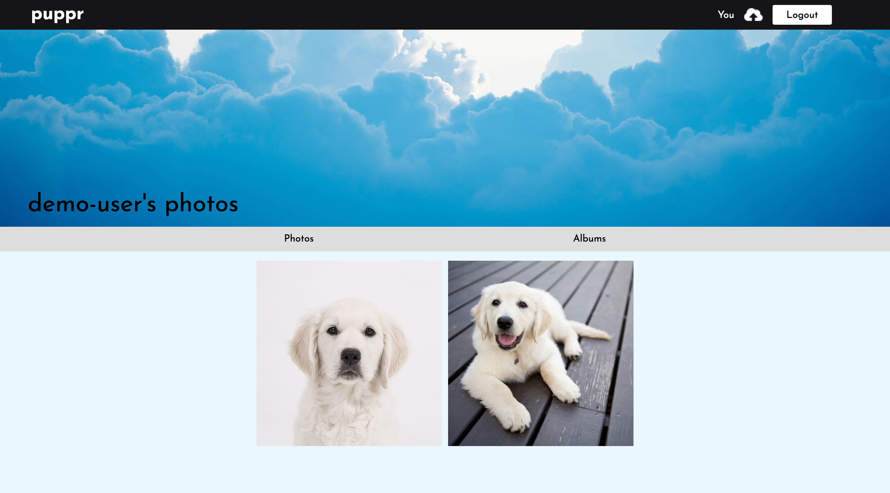
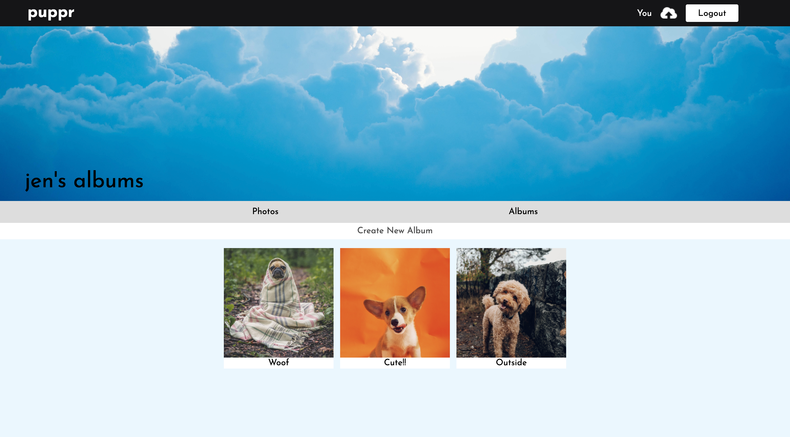
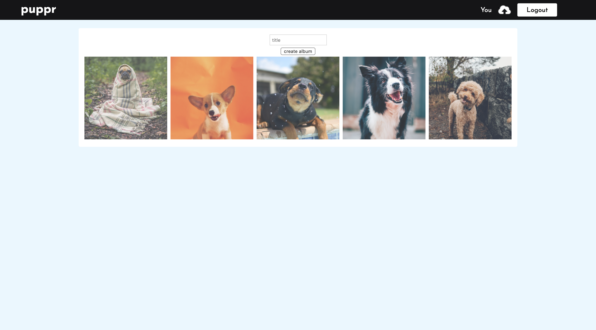

# puppr
[Live Site](http://puppr-project.herokuapp.com/#/)

Puppr is an image hosting site inspired by Flickr. It is built using the following technologies:

* Backend: Ruby on Rails with PostgreSQL database
* Frontend: React.js with Redux
* Storage: Rails Active Storage with Amazon's S3
* Other: SCSS, Webpack, Heroku

## Features

### Current Features

#### User auth

Users are required to login/signup before having access to the rest of the website using auth routes. If a user tries to access a page while not logged in, it will re-route to the login page. Errors are also rendered if forms are not properly filled.

#### Photo feed

Once logged in, a user will see the photo feed and be able to access all other pages. The navigation bar changes accordingly and now shows an upload and logout button. Trying to access the login/signup pages from here will result in rerouting to the feed. Each photo displays the user's username and title. Clicking on a photo will lead to the show page where the photo's owner can delete the photo.

#### User show page

Clicking on a username will lead to the user's show page where all of the user's photos are shown. Clicking on "you" in the header will lead to the current user's own show page. Clicking on albums leads to that user's album index.

#### Album Creation

If looking at the current user's album index, the user will have the option to create a new album. Selected photos are attached to the album through a joins table on the backend.

#### Other
* Photo show page
* Upload photos
* Delete own photos
* Create and delete own comments
* Create and delete own tags
