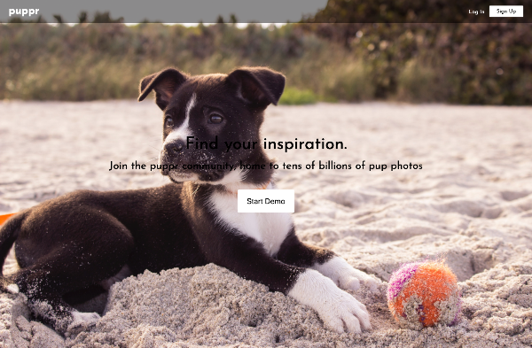

# puppr

Puppr is an image hosting site inspired by Flickr. It is build using the following technologies:

* Backend: Ruby on Rails with PostgreSQL database
* Frontend: React.js with Redux
* Storage: Rails Active Storage with Amazon's S3
* Other: SCSS, Webpack, Heroku

## Features

### Current Features

* User auth
* Photo feed
* Photo show page
* Upload photos
* Delete own photos

### Planned Features

* Create user show pages to see their photos
* Create photo edit function
* Create, edit, and delete comments
* Create, edit, and view albums
* Create tags
