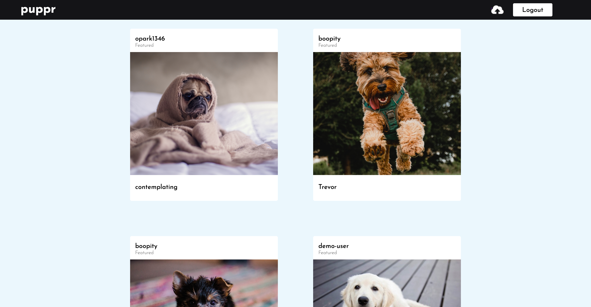

# puppr
[Live Site](http://puppr-project.herokuapp.com/#/)

Puppr is an image hosting site inspired by Flickr. It is built using the following technologies:

* Backend: Ruby on Rails with PostgreSQL database
* Frontend: React.js with Redux
* Storage: Rails Active Storage with Amazon's S3
* Other: SCSS, Webpack, Heroku

## Features

### Current Features

#### User auth

Users are required to login/signup before having access to the rest of the website using auth routes. If a user tries to access a page while not logged in, it will re-route to the login page. Errors are also rendered if forms are not properly filled.

#### Photo feed

Once logged in, a user will see the photo feed and be able to access all other pages. Clicking on a photo will lead to the show page where the photo's owner can delete the photo.

#### Other
* Photo show page
* Upload photos
* Delete own photos

### Planned Features

* Create user show pages to see their photos
* Create photo edit function
* Create, edit, and delete comments
* Create, edit, and view albums
* Create tags
